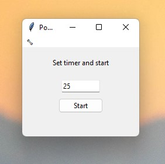
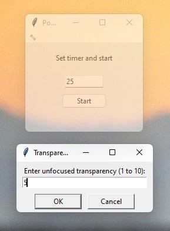

# Pomodoro Timer
A simple pomodoro timer that always stays on top of all windows. It includes basic transparency settings.

Transperancy settings will be applied on window unfocus.

### Dependency
Python should be pre installed.

## Usage 
Just use the `pomodoro.exe` file for windows. It's inside of the `dist` folder. No installation is required.

Otherwise run the `pomodoro.py` file.
```py
python pomodoro.py
```

## Screenshots
Application:



Transperancy settings:




## Making a installer
```bash
pip install pyinstaller
pyinstaller --onefile --windowed --icon=stopwatch.ico pomodoro.py
```

#### Icon attribution
<a href="https://www.flaticon.com/free-icons/timer" title="timer icons">Timer icons created by Freepik - Flaticon</a>