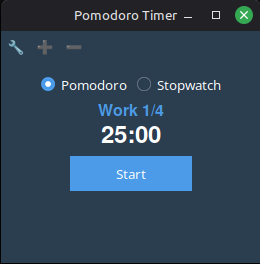
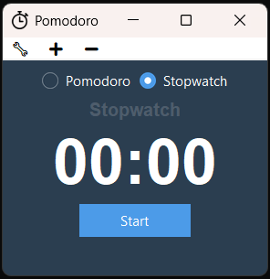

# Pomodoro Timer
A simple pomodoro timer featuring useful functionalities. 

### Features
- Classic Pomodoro cycles: Work (25m), Short Break (5m), Long Break (15m)
- Automatic break tracking (Long break after 4 work sessions)
- Endless Timer/Stopwatch Mode for long sessions
- Audio notifications on session completion
- Dedicated settings window with persistent preferences (`settings.json`)
- Modern, clean Dark Theme UI via `ttkbootstrap`
- Adjustable typography for a customizable desktop clock feel
- Always stays on top of all windows
- Includes basic transparency settings, applies on window unfocus

### Setup

We use `uv` for dependency management. If you don't have it, install it from [here](https://docs.astral.sh/uv/getting-started/installation/).

## Usage 
Just use the `pomodoro.exe` file for windows. It's inside of the `dist` folder. No installation is required.

Otherwise, run the `pomodoro.py` file using `uv`:
```py
uv run pomodoro.py
```

## Screenshots
Application:




Settings:


## Making an installer
```bash
uv run pyinstaller --clean --noconfirm pomodoro.spec
```

#### Icon attribution
<a href="https://www.flaticon.com/free-icons/timer" title="timer icons">Timer icons created by Freepik - Flaticon</a>
