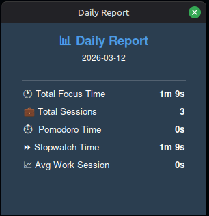

# Pomodoro Timer
A simple pomodoro timer featuring useful functionalities.

## Features
- Customizable Pomodoro cycles: Work (25m), Short Break (5m), Long Break (15m)
- Endless Timer/Stopwatch mode for custom focus sessions
- Daily Report with today's focus statistics
- Audio notifications on session completion
- Adjustable font size for a customizable desktop clock feel
- Always on top, with transparency when unfocused

## Screenshots




## Setup

We use `uv` for dependency management. Install it from [here](https://docs.astral.sh/uv/getting-started/installation/) if you don't have it.

## Running

### Run directly (all platforms)
```bash
uv run pomodoro.py
```

### Linux — Install as a desktop app (.deb)
Build and install a native `.deb` package for full desktop integration:

```bash
bash build_deb.sh
sudo dpkg -i pomodoro-timer_0.1.1_amd64.deb
```

### Windows — Build standalone executable
```bash
uv run pyinstaller --clean --noconfirm pomodoro.spec
```
Then run `dist/pomodoro.exe`.

## Running tests
```bash
uv run pytest
```

#### Icon attribution
<a href="https://www.flaticon.com/free-icons/timer" title="timer icons">Timer icons created by Freepik - Flaticon</a>
