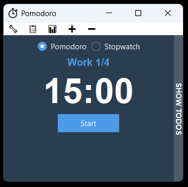
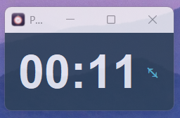
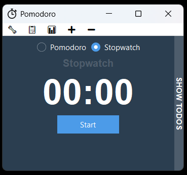
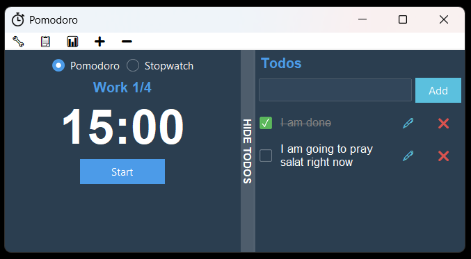
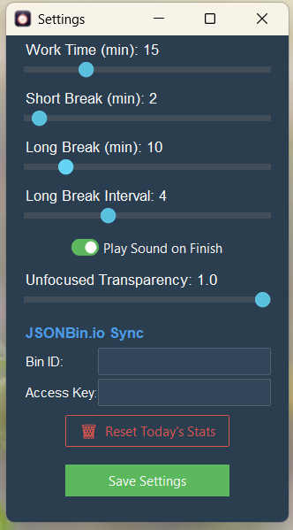
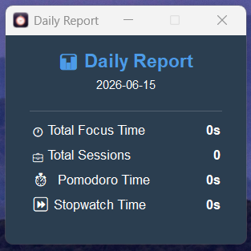

# Pomodoro Timer
A desktop Pomodoro timer and stopwatch app built with Python and Tkinter (ttkbootstrap). It includes todo management, daily stats, sound alerts, and customizable window sizes and transparency.

## Features
- Customizable Pomodoro cycles: Work, Short Break, Long Break
- Endless Timer/Stopwatch mode for custom focus sessions
- Todo management in a separate window with add, edit, delete, and completion tracking
- Daily Report with today's focus statistics and a statistics reset option in settings
- Audio notifications on session completion
- Adjustable font size for a customizable desktop clock feel
- Always on top, with transparency option when unfocused (transparency on macOS in progress)
- Timer maximize and minimize option for minimal distraction
- Remembers and restores custom window dimensions

## Screenshots













## Setup

We use `uv` for dependency management. Install it from [here](https://docs.astral.sh/uv/getting-started/installation/) if you don't have it.

## Versioning

The app version is defined once in `pyproject.toml`. Platform builds read that value for the Settings window, the Linux `.deb` package, the Windows installer, and the macOS app bundle.

## Running

### Run directly (all platforms)
```bash
uv run src/pomodoro.py
```

### Linux — Install as a desktop app (.deb)
Build and install a native `.deb` package for full desktop integration:

```bash
bash build_deb.sh
sudo dpkg -i pomodoro-timer_amd64.deb
```

### Windows — Build standalone executable
```bash
uv run pyinstaller --clean --noconfirm pomodoro.spec
```
Then run `dist/pomodoro.exe`.

### Windows — Build installer (.exe)
Creates a proper Windows installer with Start Menu shortcut and Add/Remove Programs entry.
Requires [NSIS](https://nsis.sourceforge.io/Download) installed and `makensis` in your PATH.

```bash
.\build_windows.bat
```
Then run `dist/pomodoro-timer-setup.exe` to install.

### macOS — Build standalone app bundle
```bash
uv run pyinstaller --clean --noconfirm pomodoro.spec
```
Then run `open dist/Pomodoro.app` (or double-click the bundle in Finder).

## Configuration
Settings (`settings.json`) and session statistics (`history.json`) are stored in the user profile directory:
- **Windows**: `%APPDATA%\pomodoro-timer\` (e.g., `C:\Users\<username>\AppData\Roaming\pomodoro-timer\`)
- **macOS & Linux**: `~/.config/pomodoro-timer/`

## Running tests
```bash
uv run pytest
```

#### Icon attribution
<a href="https://www.flaticon.com/free-icons/timer" title="timer icons">Timer icons created by Freepik - Flaticon</a>
