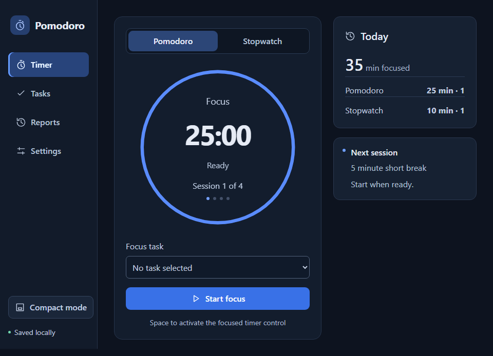
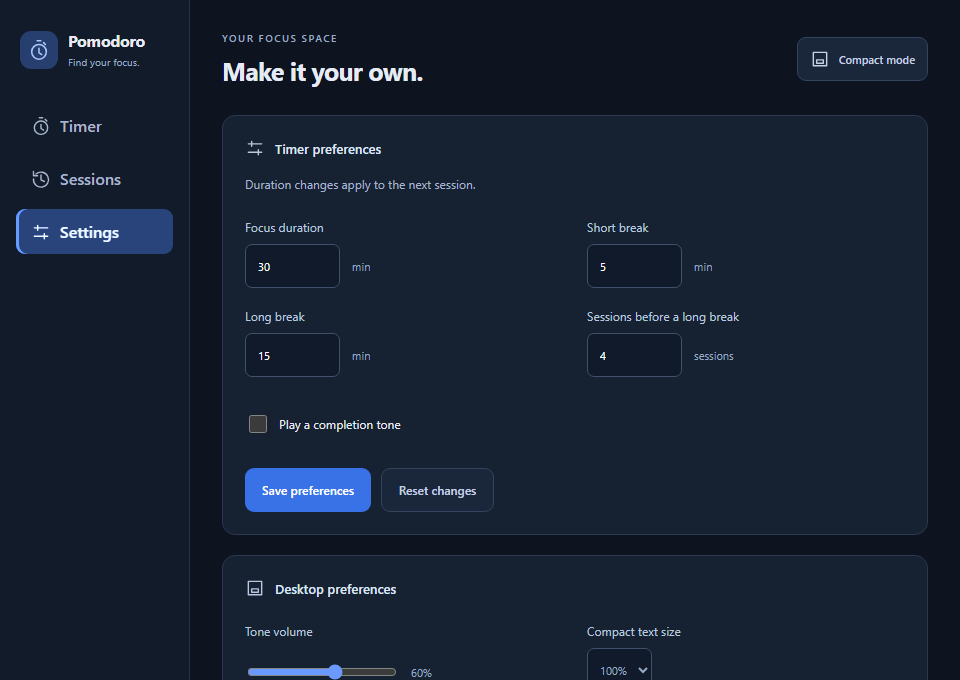

# Pomodoro Beta desktop prototype

Separate Tauri 2 / Rust / Svelte workspace for M1. The Python application remains available from the repository root. This prototype has its own application identity (`com.imranpollob.pomodoro-timer.beta`) and SQLite profile; it does not import or modify Python settings, tasks, history, or JSONBin data.

## Run locally

Install the [Tauri native prerequisites](https://v2.tauri.app/start/prerequisites/), Rust through rustup, and Node **24.19.0** (npm **11.17.0**). Rust **1.99.0**, rustfmt, and Clippy are selected by `rust-toolchain.toml`. Frontend dependencies and Cargo dependencies are locked.

- Windows: Microsoft C++ Build Tools with Desktop development with C++, and WebView2.
- macOS: Xcode Command Line Tools (`xcode-select --install`).
- Ubuntu/Debian: WebKitGTK 4.1, GTK 3, AppIndicator, OpenSSL, ALSA headers (`libasound2-dev`), librsvg and build tools. See the prerequisite guide and `.github/workflows/desktop.yml` for packages.

```text
cd desktop
npm ci
npm run tauri -- dev
```

`npm run dev` alone opens the frontend with a desktop-connection message; production code never substitutes a browser timer for the Rust authority.

### Windows first-time setup

Node/npm alone are insufficient to launch the native application. If Tauri reports `cargo metadata ... program not found`, Rust/Cargo is missing or the terminal has not picked up its installation. Install the C++ workload from an **administrator PowerShell**, and Rust from your normal user PowerShell:

```powershell
winget install --id Microsoft.VisualStudio.2022.BuildTools --exact --source winget --override "--wait --quiet --norestart --add Microsoft.VisualStudio.Workload.VCTools --includeRecommended"
winget install --id Rustlang.Rustup --exact --source winget
```

The C++ workload includes MSVC and the Windows SDK; its installer requires administrator approval. Installer exit code **1602** indicates cancellation, not a completed installation. After both installations finish, restart the IDE and terminal so they pick up Cargo's PATH, then run:

```powershell
cd C:\Users\imran\Coding\pomodoro-timer\desktop
rustup toolchain install 1.99.0 --profile minimal --component rustfmt --component clippy
cargo --version
npm ci
npm run tauri -- dev
```

Use your checkout's path if different. Install [WebView2 Runtime](https://developer.microsoft.com/en-us/microsoft-edge/webview2/) if Windows reports that it is missing. A `link.exe not found` or Windows SDK error means the C++ workload is incomplete; installing Rust alone does not supply these tools. Rust installed inside WSL is separate from native Windows Rust.

## Current prototype

- Pomodoro, short/long breaks, stopwatch, precise pause/resume and explicit finish confirmation.
- Main window and **200 × 44** compact countdown with one action button. Click/double-click time, use an assistive-technology invoke, or press Enter there to reopen main; right-click/Shift+F10 opens the native menu. Space starts/pauses/resumes. Main remains reachable if the desktop has no tray.
- One serialized Rust service processes UI/tray commands. Window subscriptions accept monotonically increasing revisions. No frontend timer decrements session duration.
- SQLite transactions save completed/interrupted/skipped sessions and paused checkpoints together. Checkpoints occur on transitions and every 15 seconds while running. Restart restores paused and excludes time while the process was absent. A crash can lose active time since the last checkpoint.
- Failed saves freeze active time, block replacement sessions, and expose retry. Preferences apply to future sessions. Sessions view shows the latest 20 records, not lifetime or daily totals.
- Native audio works independently of webview visibility, with volume/mute, cancellable preview and output-device errors. Completion notifications and editable global timer/open-window shortcuts are opt-in. Shortcut conflicts preserve previous settings.
- Windows suspend/lock broadcasts pause active work using the notification's timestamp; wake/unlock requires explicit resume. The listener bounds its checkpoint wait to one second. Failed/slow writes retain the existing retry/recovery boundaries. Native macOS/Linux suspend adapters and Wayland portal shortcuts remain pending.
- SQLite stores desktop preferences, compact pinning, and debounced main/compact placement. Placement is clamped to connected monitor work areas on Windows. Compact text supports 100/125/150/200% and grows automatically; manual edge resizing is disabled. The compact strip has no native shadow to preserve its height on Windows.

Set `POMODORO_BETA_DATA_DIR` **before launching** to use an isolated beta profile. The default is Tauri's app-data directory for the beta identifier; its location appears under Settings → Desktop checks. `prototype.sqlite3` and its WAL/SHM sidecars belong to this profile. Back up the whole profile with the app closed. Schema 2 upgrades schema 1 transactionally while retaining sessions/checkpoints. The schema remains a prototype with no stable migration promise yet.

## Verify and build

```text
npm run build
npm test
npx playwright install chromium
npm run test:ui
cargo fmt --all --check
cargo test --locked -p focus-core
cargo test --locked -p pomodoro-desktop-beta --lib
cargo clippy --locked --workspace --all-targets -- -D warnings
npm run tauri -- build --ci -- --locked
```

Rust tests inject clocks and persistence failures. Vitest verifies event ordering and listener cleanup. Playwright exercises actual Svelte views with a test-only IPC fixture; it does not prove native menus, assistive technology, or OS behavior. Normal builds have no simulated backend or embedded test driver.

The CI workflow creates **unsigned prototype** `.deb`, NSIS and `.dmg` artifacts. It does not publish a release or replace the legacy release workflow. Production packages use normal features. A separate executable with the `smoke-test` feature validates native webview IPC, shared commands, session persistence and checkpoint read-back:

```text
cargo build --locked -p pomodoro-desktop-beta --features custom-protocol,smoke-test
python scripts/native_smoke.py target/debug/pomodoro-desktop-beta
```

Use `.exe` on Windows; on headless Linux wrap the Python command with `dbus-run-session -- xvfb-run --auto-servernum`. The smoke uses a temporary profile and exits itself. Smoke code is compiled out of normal builds, and this feature must never be enabled for distributed artifacts.

### Windows packages and normal-build checks

From `desktop/`:

```powershell
npm run tauri -- build --ci --bundles nsis -- --locked
uv venv ../build/windows-uia-env --python 3.12
$testPython = (Resolve-Path ../build/windows-uia-env/Scripts/python.exe).Path
uv pip install --python $testPython -r scripts/requirements-windows-ui.txt
& $testPython scripts/windows_ui_smoke.py target/release/pomodoro-desktop-beta.exe
$installer = Get-ChildItem target/release/bundle/nsis/*-setup.exe | Select-Object -First 1
./scripts/windows_install_smoke.ps1 -Installer $installer.FullName -Python $testPython
```

Use a separate Python environment for the UI test dependencies. The harness drives a normal binary through Windows UI Automation, with temporary data and no embedded driver. It checks real background shortcuts using its own foreground test window, compact size, accessible reopen, single-instance behavior, checkpointing and restart recovery. An unlocked desktop session is required.

The installer probe refuses to replace an existing beta installation, verifies its install directory inside the workspace, and removes only that test installation. Silent uninstall retains application data. These are unsigned beta packages; signing, updater and stable-release acceptance remain separate work.

Optional `POMODORO_TEST_AUDIO=1` and `POMODORO_TEST_NOTIFICATION=1` enable output-device and notification request checks. API success does not confirm hearing or receipt. Use Settings → Desktop checks for manual confirmation; desktop permission APIs do not establish Windows Focus Assist or notification-center delivery.

## Architecture and next gates

`crates/focus-core` owns the clock-injected domain, service and SQLite access, without Tauri dependencies. `src-tauri` supplies windows, events, tray, notifications and process lifecycle. `src` contains presentation and typed IPC consumers.

Use the [native platform checklist](../docs/implementation/platform-validation.md). Windows development launch is user-confirmed, and installed-build automation is available. Physical suspend/resume, Narrator, monitor removal and manual audio/notification delivery remain Windows acceptance checks. The user will perform macOS/Linux-specific work when on those machines. Three-platform support remains mandatory. Tasks/projects, legacy migration, full reporting, safe sync and the remaining planned windows follow their backlog batches.

## Implemented views

These screenshots show the implemented Svelte UI rendered by Playwright with fixture data on October 5, 2026. They illustrate the prototype; native platform appearance and capabilities require separate validation.





