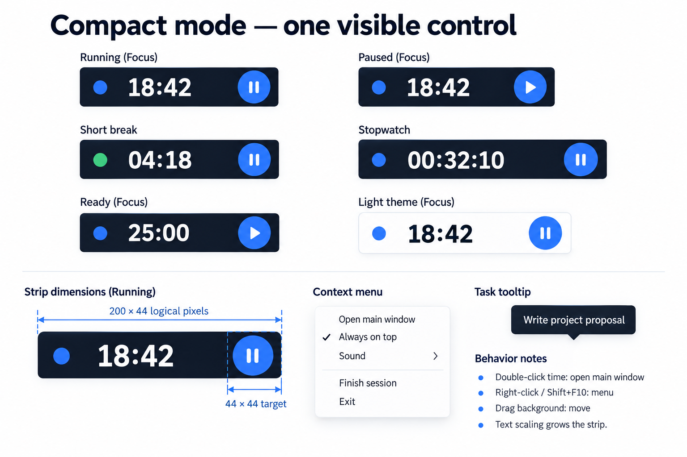

# UI design specification — revision 2

Prepared October 4, 2026. Companion to the [implementation plan](implementation-plan.md) and [complete mockup gallery](mockups/v2/README.md).

The revision covers the first stable replacement's app windows, dialogs, menus, and important states. The gallery also separates later-release concepts. These are design proposals, not screenshots of implemented software. The written behavior below takes precedence over generated image details, example numbers, or incidental labels.

## Compact mode: deliberately minimal

**At default text scale, target 200 × 44 logical pixels for countdown, and up to 240 × 44 for an hours-based stopwatch.** The previous 340 × 110 proposal is superseded. These are logical dimensions, independent of a monitor's pixel density.

Only three elements remain visible:

- A small work/break indicator, with its meaning available to assistive technology.
- Remaining time, or elapsed time for stopwatch, using tabular digits.
- **One 44 × 44 play/pause button.** It means Start when idle, Pause when running, and Resume when paused.

No task title, title bar, close/minimize buttons, pin/expand buttons, stop button, menu button, navigation, summary, progress ring, or cycle label occupies the strip. The current task is available in a tooltip and the accessible description. There are no controls that appear only on hover. The single visible control remains visible during pointer and keyboard operation.

### Compact interaction contract

| Interaction | Result |
| --- | --- |
| Activate the one button | Start, pause, or resume the authoritative session; never create a second timer |
| Space when compact is focused | Same start/pause/resume command |
| Double-click the time | Open and focus the main window without changing session state |
| Enter when the time region is focused | Open the main window; Enter on the button activates that button |
| Right-click, Shift+F10, or keyboard menu key | Open the same accessible context menu |
| Drag unused background | Move the strip where the desktop permits placement |
| Escape while a context menu is open | Close the menu and return focus to the strip |
| Hover/focus the time region | Show task and phase in a tooltip; do not change layout |

Tab moves between the time region and the single button. A thin focus outline uses existing interior space. Accessible names include phase, remaining/elapsed time, task, and current action. Screen readers must not announce every timer tick; announce deliberate actions and phase changes.

The context menu contains **Open main window**, **Always on top** (checked when active), **Sound** (checked), **Finish session** (or **Skip break** during a break), and **Exit**. Actions that do not apply are disabled or omitted. Start/pause is already on the strip. Platform capability explanations appear beside disabled optional integration actions, never as another permanent compact button.

Finish while focusing opens the same finish-early confirmation as the main window. Exit uses the running-session exit dialog. Pinning and sound settings stay synchronized with Settings; opening the main window does not require unpinning first.

Compact entry is available in the main window and tray, with an editable shortcut. A one-time hint in the main window explains double-click and the context menu. Do not leave onboarding text inside the compact strip.

### Compact layout and edge cases

- At 100% scale, reserve 44 logical pixels for the action target, about 8 pixels of outer spacing, and sufficient room for the digits and indicator.
- Respect OS/application text scale. Grow width and height at larger sizes; never shrink text to force a fixed rectangle. Test 100%, 125%, 150%, and 200%.
- For durations above an hour, render hours without truncation and grow width as needed. A stopwatch must not roll its display over at 59:59.
- The task tooltip wraps long names. Long names must not enlarge the strip.
- Light/dark themes keep the same geometry. Break phase uses both accessible text and color; color alone is insufficient.
- Opacity never reduces the timer's usable contrast. Restore an opaque background when the compositor cannot provide usable transparency.
- Keep the strip reachable after monitor removal and DPI changes. Use desktop-supported movement/placement mechanisms; validate actual Wayland behavior during M1.
- A storage failure opens or raises the main recovery surface with a clear error. Do not add a stack of error buttons to the strip or imply a session was saved.
- Hiding/showing views must not affect timing. If both main and compact are visible, both receive the same backend state; they do not schedule independent sessions.

The three-platform requirement is unchanged. Windows, macOS, and Linux are mandatory release targets. Pinning, placement, shortcuts, tray, transparency, and notifications must be tested per supported desktop; artwork is not evidence of native capability.

## Navigation and window model

The main window has four primary destinations: **Timer, Tasks, Reports, Settings**. Pomodoro and Stopwatch are modes within Timer. Changing timer modes during active focus requires resolving the current session through the finish/keep-focusing pattern; it cannot silently discard time.

Settings uses these categories: Timer; Appearance; Sound & notifications; Shortcuts; Desktop; Sync; Data & recovery; About. Settings are a main-window destination rather than a collection of unrelated floating windows. Task editors and other short decisions use dialogs attached to their parent. Long lists such as rejected import records and licenses use a readable scrollable view.

Main-window design target: roughly 960 × 680 logical pixels, subject to content and accessibility checks. Validate a narrower layout around 760 × 560 and at 200% text scale. Collapse navigation into a labelled menu when necessary; content scrolls vertically, action rows wrap, and dialogs fit within the available work area. These targets are not grounds to exclude an OS, resolution, or assistive setting.

Use native window decorations for the main window and appropriate native file dialogs. Compact is deliberately borderless. The platform board illustrates Windows, macOS, and Linux chrome; Linux appearance varies by desktop environment. Avoid forcing macOS traffic-light placement onto Windows/Linux.

## Window and state coverage

Each row names a distinct user-facing surface or a reusable dialog pattern. A board can contain several complete windows and variants. **Shown** means included in the concept image, not implemented or tested. Inline/behavior states are explicitly listed where a static image cannot prove interaction.

| ID | Surface or state | Board | Coverage and behavior |
| --- | --- | --- | --- |
| T01 | Pomodoro ready | 01 | Shown; selected task, cycle, next break, Start |
| T02 | Pomodoro running | 01 | Shown; Pause, Finish, today's totals; prototype adds the specified compact entry |
| T03 | Pomodoro paused | 01 | Shown; Resume retains exact remaining time |
| T04 | Short break | 02 | Shown; Pause and Skip break |
| T05 | Long break / paused break | 02 | Shown; Resume and Skip break |
| T06 | Stopwatch running | 02 | Shown; elapsed hours, Pause, Finish, task |
| T07 | Stopwatch idle / paused | 01–02 | Uses T01/T03 controls with elapsed-time layout; no cycle or countdown ring |
| T08 | Resume after sleep / crash | 10 | Shown; Resume, Keep paused, Finish; elapsed absence is excluded |
| T09 | Session complete / waiting for break | 18 | Shown; recorded active duration, Start break or Dismiss; auto-start follows preference |
| C01 | Compact focus running | 03 | Shown; one Pause control |
| C02 | Compact paused / ready | 03 | Shown; one Resume / Start control |
| C03 | Compact break | 03 | Shown; break indicator and one Pause control |
| C04 | Compact stopwatch | 03 | Shown; hours fit without extra controls |
| C05 | Compact light theme | 03 | Shown; identical interaction and geometry |
| C06 | Compact context menu / task tooltip | 03 | Shown; keyboard equivalents specified above |
| K01 | Task list / selected task details | 04 | Shown; project filter, estimate, actual duration, focus action |
| K02 | New / edit task dialog | 04 | Shown; same fields, title validation, save/cancel |
| K03 | New / edit project dialog | 04 | Shown creation pattern; edit reuses fields and Save label |
| K04 | Archived tasks / restore | 04 | Shown; restoring does not recreate a duplicate |
| K05 | Archive confirmation / undo | 12 | Shown reusable pattern; includes project archive with affected-task explanation |
| K06 | Unsaved editor changes | 18 | Shown; Keep editing, Discard, Save; failed save keeps draft |
| K07 | No tasks / no filter results | 12 | Empty state shown; filtered empty uses Clear filters instead of Add task |
| R01 | Reports overview | 05 | Shown week; Today/Month reuse layout with range-appropriate aggregation |
| R02 | Custom date range / project filter | 05 | Shown range popover; invalid start/end requires inline correction |
| R03 | Session details | 05 | Shown; active and paused time, task, date, completion status |
| R04 | Export report | 05 | Shown; CSV/JSON, selected range and projects, failure feedback |
| R05 | Empty reports / loading | 12 | Shown; no invented sample history in empty product state |
| R06 | Long history / timezone change | 05, 12 | Same paged/virtualized list and loading pattern; timezone shown in date/time labels |
| R07 | Daily Pomodoro / stopwatch breakdown | 17 | Shown; retains the current daily report's separate mode totals |
| R08 | Reset today's statistics confirmation | 17 | Shown; existing action retained, backed up and disabled during active sessions |
| R09 | Reset success / backup or write failure | 17 | Shown; failure leaves records unchanged; successful reset links to recovery |
| S01 | Timer settings | 06 | Shown; validated durations/cycle, auto-start, sleep/lock policy |
| S02 | Appearance settings | 06 | Shown; theme, text size, reduced motion, supported opacity |
| S03 | Sound / notifications | 07 | Shown; volume, preview, alerts, blocked permission |
| S04 | Shortcut settings / capture | 07 | Shown; local/global distinction, capture dialog, conflict/unavailable states |
| S05 | Desktop settings | 08 | Shown; login, tray, geometry, compact pinning |
| S06 | Sync settings off / connected | 08 | Shown; optional connection, last success, pending state |
| S07 | Data / recovery settings | 09 | Shown; backup, export, import, restore |
| S08 | About | 08 | Shown; updates, notes, diagnostic export, licenses |
| D01 | Backup / whole-data export | 09, 16 | Entry shown; native destination chooser, success/failure status |
| D02 | Import preview | 09 | Shown; counts, validation results, original preservation |
| D03 | Rejected records review | 16 | Shown; reason per record and recovery export; no silent discard |
| D04 | Restore backup confirmation | 09 | Shown; selected backup details and protective current-data backup |
| D05 | Corrupt data recovery | 09 | Shown; restore/choose backup/export recovery files |
| D06 | Failed persistence | 12 | Shown; retry and export recovery data; never report Saved |
| O01 | First launch | 10 | Shown; Import existing data or Start fresh, no required account |
| O02 | Legacy import preview | 10 | Shown; counts, original files retained, cancel/import |
| O03 | Migration completion | 10 | Shown; summary and Continue; failures use D03/D05 patterns |
| O04 | Notification opt-in | 10, 16 | App explanation and system-owned permission concept shown; Later remains usable |
| Y01 | Sync connection | 11 | Shown; provider-neutral concept, masked secret, validation |
| Y02 | Offline / pending changes | 11 | Shown; Saved on this device, retry, pending count |
| Y03 | Conflict resolution | 11 | Shown; two revisions, choose either or keep both |
| Y04 | Disconnect confirmation | 18 | Shown; local data preserved, credential removal explained |
| Y05 | Authentication / server failure | 11, 18 | Reconnect/expired credential shown; server failure reuses actionable banner/retry |
| A01 | Finish early / change active mode | 12 | Shown reusable confirmation; active duration preserved as interrupted |
| A02 | Quit while focusing | 13 | Shown; pause-and-quit, continue in background when supported, cancel |
| A03 | Invalid input / failed save | 04, 06, 12 | Shown patterns; highlight field, retain values, focus first error |
| A04 | Transient success / undo | 12 | Shown archive toast; announced politely, keyboard-accessible action |
| N01 | Tray / menu-bar menu | 13 | Shown; current phase/time, primary action, open/compact/quit |
| N02 | Completion notification | 13 | Shown concept; available native actions depend on the OS |
| N03 | Tray absent / notifications denied | 07–08 | Shown fallbacks; hidden app remains recoverable through normal launch |
| U01 | Update available / release notes | 13, 16 | Shown; non-blocking offer and separate notes view |
| U02 | Download in progress | 13 | Shown; progress, cancellation, timer keeps running |
| U03 | Download / verification failure | 13 | Failure shown; unverified update is never installed |
| U04 | Ready to install | 13 | Shown; defer until session ends, Later, controlled restart |
| H01 | Open-source licenses | 16 | Shown; searchable list and readable license text |
| H02 | Diagnostic export | 16 | Shown; redacted preview, explicit export, cancel |
| H03 | Native open/save dialog | 16 | System-owned concept shown; use OS chooser and cancellation behavior |
| P01 | Windows / macOS / Linux shell | 14 | Shown same app behavior; native chrome differs |
| P02 | Keyboard focus / larger text | 14 | Shown focus and 150% text concept; test all defined scales |
| F01 | Fullscreen break overlay | 15 | Shown later-release concept; always reachable exit/skip |
| F02 | Scheduled special breaks | 15 | Shown later-release settings/dialog |
| F03 | Goals / reminders | 15 | Shown later-release settings |
| F04 | Custom theme import | 15 | Shown later-release preview and contrast feedback |

Boards are indexed and embedded in the [gallery](mockups/v2/README.md). Reusable patterns deliberately avoid creating a different window for every error. Any new feature must add its surfaces and exceptional states to this inventory before implementation.

## Existing-window parity

The current [Python UI](../../src/pomodoro.py) was checked for its actual top-level windows and message boxes:

| Current surface | Replacement |
| --- | --- |
| Main Pomodoro / stopwatch / mini window | Timer and minimal compact, boards 01–03 |
| Todos dialog | Tasks, editor, archive, and optional sync, boards 04/11 |
| Settings dialog | Eight settings categories, boards 06–09; scaling replaces font buttons |
| Daily Report dialog | Reports Today with separate Pomodoro/stopwatch totals, board 17 |
| Confirm Reset / Reset Complete / reset error | Reset confirmation and outcomes, board 17 |

The existing unfocused transparency preference is retained as an appearance setting where the desktop supports it. The settings board's compact-opacity preview is illustrative; focused text and controls must remain readable. JSONBin migration retains a safe task-sync path, with provider/protocol decisions handled in M1/M6.

## Screen behavior details

### Timer and breaks

The main screen displays the active phase, active task, remaining or elapsed time, cycle position when relevant, next phase, primary action, and daily summary. Keep task selection usable without interrupting a session; changing attribution must follow the domain rules and clearly explain whether it applies to the current session.

Start/Pause/Resume is the prominent action. Finish is secondary and records active time. During breaks it becomes Skip break. Automatically beginning the next phase follows saved settings; by default a completion announces the outcome and waits for the user. Reduced-motion mode avoids animated rings or celebrations.

A suspended, restored, or failed-save session does not masquerade as a normal completed session. Resume-after-sleep and resume-after-crash share a presentation but retain distinct explanations and domain events.

### Tasks and projects

Task rows expose title, project, completion state, estimate, and actual focus duration. Select a row for details; editing uses the same validated form for new and existing tasks. Do not add deadlines, boards, subtasks, or scheduling to the stable scope through a mockup.

Archive rather than destroy on the ordinary list action; offer Undo and a browsable archive. Project archive must explain where associated tasks will appear. No destructive cascade may be implied by a harmless-looking project removal.

Preserve editor drafts through failed persistence or sync responses. Confirm leaving a modified draft; cancelling returns focus to the invoking control. A conflict never overwrites an unsaved draft behind the user's back.

### Reports

Today, Week, Month, and Custom share a consistent report layout. Show active focus duration, completed/interrupted sessions, project attribution, and a detail list. Breaks are not counted as focus. Interrupted sessions use a neutral outcome style, not an error warning. Date labels must state the effective timezone when ambiguity matters.

The chart has a table/text alternative and does not depend on color alone. Custom ranges validate before loading. Large histories use pagination/virtualization without losing keyboard focus. Export covers the visible filter scope; failures retain selections and allow another destination. A native save cancellation is neutral, not an error.

Retain Reset today's statistics in the daily report/data-management path. Disable it during an active or paused session until the user explicitly finishes that session. Confirmation specifies the local-date range and record count. Create a recoverable backup before an atomic date-scoped deletion, recompute affected task/project totals, and preserve all other dates, tasks, and settings. A backup or transaction failure changes no records. Success shows the backup/recovery location; no automatic reset occurs at midnight.

### Settings and permissions

Settings changes show explicit save state or a clear saved-on-device status after successful persistence. Duration changes apply to future sessions. A running session retains its original configuration.

Capture shortcuts in a small focused dialog; explain conflicts without replacing another binding silently. Separate in-app shortcuts from global shortcuts and native permission requirements. Unavailable OS integrations get a concise capability explanation, while timer/tasks/reports remain operable.

Audio preview must be cancellable and respect volume. Notification setup is optional. Explain how to enable permission through the OS; never fabricate an OS permission dialog inside app code.

### Data, onboarding, and recovery

First launch offers import or a clean local start. Import/restore previews list counts and validation findings, preserve original files, and show transaction results. Restoring first backs up current data. Any action that cannot create its protective backup must stop and explain the failure.

Malformed records have a review/export path. A corrupt database has a recovery view before new writes can overwrite recoverable input. A persistence failure remains visible until resolved or recovery data is safely exported.

State labels are **Saved on this device**, **Syncing**, **Offline**, and **Needs attention**. These describe different facts: Offline must not imply a failed local save, and a failed local save must not show Saved.

### Sync

Vendor selection remains an M1 architecture decision. The connection window is a provider-neutral concept; adapt its fields to the selected provider without leaking database/protocol implementation details into everyday use.

Credential inputs are masked and excluded from logs. Connection validation, expired credentials, offline operation, pending edits, conflicts, and disconnect must all have defined transitions. Show both conflicting task values and relevant revision details. Keep both creates two deliberate task records and explains that choice.

Disconnect removes the local credential if requested and preserves local tasks. Remote deletion is a separate explicit action if a later design requires it; it is not hidden inside Disconnect.

### Tray, notifications, updates, and support

Tray/menu-bar actions dispatch the same commands as the main/compact views. On desktops without tray support, closing cannot make an active app unreachable. A second launch restores an existing main window.

The exit dialog's **Continue in background** action is available only when a tested background/reopen path exists; otherwise omit it. The conceptual board's "Keep running" label refers to this behavior, not running after process termination. Pause and quit records the transition safely.

Updates download/verify without interrupting focus. Installation requires a safe restart and defers while a session is active. Native completion notification actions are best effort; the same actions remain available in the main window on all three platforms.

About links to release notes and licenses and offers a user-triggered diagnostic export. Exported diagnostics exclude secrets, task titles/notes, and unnecessary personal paths by default. A preview explains included information before export.

## Shared visual and accessibility rules

| Element | Proposed foundation |
| --- | --- |
| Typography | Platform system sans-serif; 14 logical pixels base, 12 minimum for secondary text; tabular timer digits |
| Spacing | 4/8/12/16/24/32 logical pixels; prefer 8-pixel rhythm |
| Accent | Blue #4C7DFF, with separate interaction colors chosen for sufficient contrast |
| Dark surfaces | #111827 canvas, #1B2435 cards; visible focus and separators |
| Light surfaces | #F7F8FC canvas, white cards, dark readable text |
| Break state | Green/teal plus explicit phase text and accessible description |
| Corners | Approximately 10 pixels for cards/dialogs, restrained rather than ornamental |
| Focus | High-contrast visible ring, never clipped by compact edges |
| Targets | 44 × 44 primary compact target; generous desktop controls, keyboard equivalents |
| Motion | Subtle progress only; respect reduced-motion preference |
| Feedback | Inline field errors, persistent recoverable error banners, brief polite success/undo notices |

Hex colors are starting tokens, not a claim that every combination passes contrast. Validate text/control/focus contrast in both themes before finalizing. Semantic states must not use color alone. Timers and charts need screen-reader-friendly summaries without continuous announcements.

Dialogs manage initial focus, trap focus only while modal, support Escape where cancellation is safe, restore focus, and use meaningful primary/secondary labels. Enter must not silently accept a destructive confirmation. Validation is announced and retains all input. Tooltips duplicate information available to keyboards and assistive technology.

## Design completion gate for M1

- [ ] Review all stable inventory rows and choose final copy/flows; unresolved items are recorded explicitly.
- [ ] Convert proposed tokens and components into a shared light/dark component library.
- [ ] Implement a reviewable UI prototype for the main timer, minimal compact, task editor, settings, recovery, and one full report journey.
- [ ] Exercise start → pause → resume → finish/break through main, compact, tray, and shortcuts against one timer authority.
- [ ] Exercise import → preview → success/failure, offline edit → conflict, and storage failure → recovery.
- [ ] Verify layout at narrower windows, long titles, large durations, 100–200% text scale, keyboard-only operation, and representative screen readers.
- [ ] Validate packaged Windows/macOS/Linux behavior including Linux GNOME/KDE Wayland/X11 as defined by the implementation plan.
- [ ] Record actual compact dimensions and control count. Any extra permanent compact control requires a demonstrated accessibility/user need and an explicit design revision.
- [ ] Update estimates after prototype evidence; the larger design inventory is not evidence that implementation is already complete.

## Asset provenance

All revision-2 boards were generated with the built-in image generation tool. [Exact prompts](mockups/v2/prompts.json) are checked in beside the PNGs. The gallery includes all selected boards. Revision-1 images remain in the parent mockups directory as historical drafts and are superseded for current design direction.

Generated raster concepts can contain small text, geometry, and platform-chrome inconsistencies. Use this specification for implementation decisions. The assets intentionally show exceptional states in separate panels; they are not all simultaneously visible in the product.

